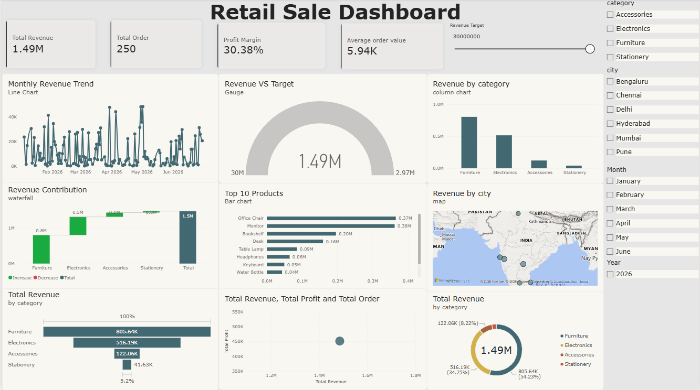

# Retail Sales Power BI Dashboard

Interactive Retail Sales Dashboard built using **Power BI, DAX, and Power Query**.

## Dashboard Preview

## Key Features

- Total Revenue
- Total Orders
- Total Profit
- Profit Margin
- Total Customers
- Average Order Value
- Monthly sales and profit analysis
- Interactive slicers and filters
- Sales performance analysis

## Tools & Technologies

- Power BI
- DAX
- Power Query
- Excel

## Project File

The Power BI project file is available here:

[Download Power BI File](retail_sale.pbix)
